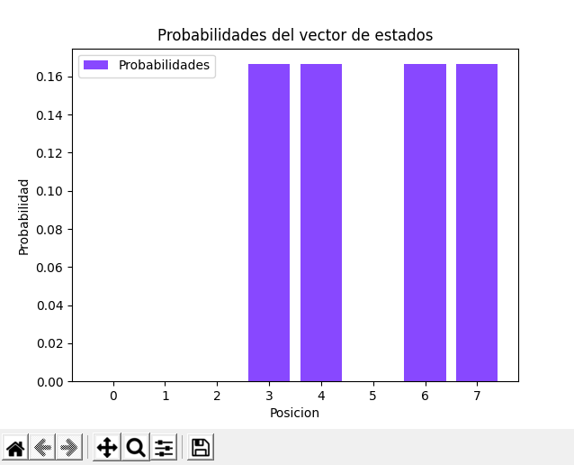

# Competencia-doble-rendija

# Introducción

_El experimento de la doble rendija fue realizado por primera vez por el científico Thomas Young en el año 1801, este experimento consistía en emitir luz a través de dos rendijas y observar un patrón de interferencias que es ocasionado luego de que la luz se difractara al pasar por las dos rendijas. Este experimento tiene una gran relevancia en el mundo de la mecánica cuántica ya que mediante el se pueden evidenciar conceptos como:_

- Superposición: El estado de un sistema puede contener múltiples historias
- Interferencia: Las historias de los sistemas pueden interactuar entre si  

# Montaje del experimento 

_Este experimento puede realizarse de manera sencilla, para empezar hay que hacer dos o más cortes rectos y muy finos en una superficie (en este caso una hoja de aluminio), seguido de esto, hacer un corte rectangular en otra superficie (en este caso, cartón paja), de manera de que en la superficie resulte con una “ventana”, posteriormente se pegara con cinta la superficie en la que se hicieron las rendijas en la superficie en la cual se hizo la ventana, una vez hecho esto, se pondrá la superficie que se acaba de realizar delante de una pared u otra superficie que de preferencia tenga algún color oscuro, luego se apuntara con un emisor de luz (en este caso, un láser infrarrojo) a las rendijas que se encuentran en la superficie y se observara el patrón resultante en la superficie de color oscuro. A continuación, se enlistan los materiales que fueron usados para realizar el experimento y se encuentran algunas fotos del montaje._

_Materiales:_

-	1/8 de cartón paja
-	Un láser infrarrojo
-	Una hoja de papel aluminio
-	Un bisturí de precisión 
-	Cinta de enmascarar
- Un soporte para poder sostener el infrarrojo

# Fotos del montaje

# Explicación

_Muchas personas explican el patrón que se puede evidenciar en el experimento como un efecto causado por la interferencia entre las ondas que son generadas en el momento en el que la luz del infrarrojo pasa a través de las rendijas, sin embargo al momento de realizar el experimento lanzando electrones a la doble rendija en vez de los fotones que emite el infrarrojo, se vuelve a generar el mismo patrón, otra explicación a este fenómeno es la que plantea David Deutch en su libro “The fabric of reality”, en la cual el autor plantea que lo que normalmente consideramos como el universo (El todo de la realidad física) realmente solo es una pequeña porción del multiverso, sumado a esto, los diferentes experimentos de interferencia con partículas son la muestra de que existe un multiverso que contiene varias contra partes de cada partícula en nuestro universo tangible, en otras palabras, el multiverso está particionado en varios universos paralelos y el fenómeno de la interferencia se debe considerar como algo que envuelve a más de una partícula, ya que son las múltiples historias de una partícula las que están interactuando entre sí._

# Simulación

_Este experimento se puede simular usando la librería que está adjunta en este mismo repositorio, el montaje del experimento de la doble rendija se puede visualizar como un grafo y como una matriz de adyacencia con un vector de estados asociado como se puede ver a continuación._

# Simulación probabilística

_La matriz y el vector de estados inicial de la simulación probabilística resultan de la siguiente forma:_

_Tras hacer un click, es decir, moverse en una unidad de tiempo en el experimento, el resultado de la matriz y el vector resultante son los siguientes:_

_La grafica del vector de estados del experimento probabilístico resulta:_

# Simulación cuántica

- Para tener en cuenta, la representación de un número complejo está dada por una tupla, en la cual el primer valor es la parte real del numero y la segunda parte es la parte imaginaria del número. ejemplo:

_Complejo = 4-12i_
_Representación: (4, -12)_

_La matriz y el vector de estados inicial de la simulación cuántica resultan de la siguiente forma:_

_Tras hacer un click, es decir, moverse en una unidad de tiempo en el experimento, el resultado de la matriz y el vector resultante son los siguientes:_

_La grafica del vector de estados del experimento cuántico resulta:_

_Para poder obtener la probabilidad de cada estado en el vector de estados del experimento cuántico hay que sacar el modulo al cuadrado de cada numero complejo del vector de estados_

# Requisitos para poder usar la librería

_Tener instalado Python, preferiblemente la versión 3.9 y descargar los dos archivos .py que se encuentran en este mismo repositorio_

# Autor

_Kristhian David Segura_

